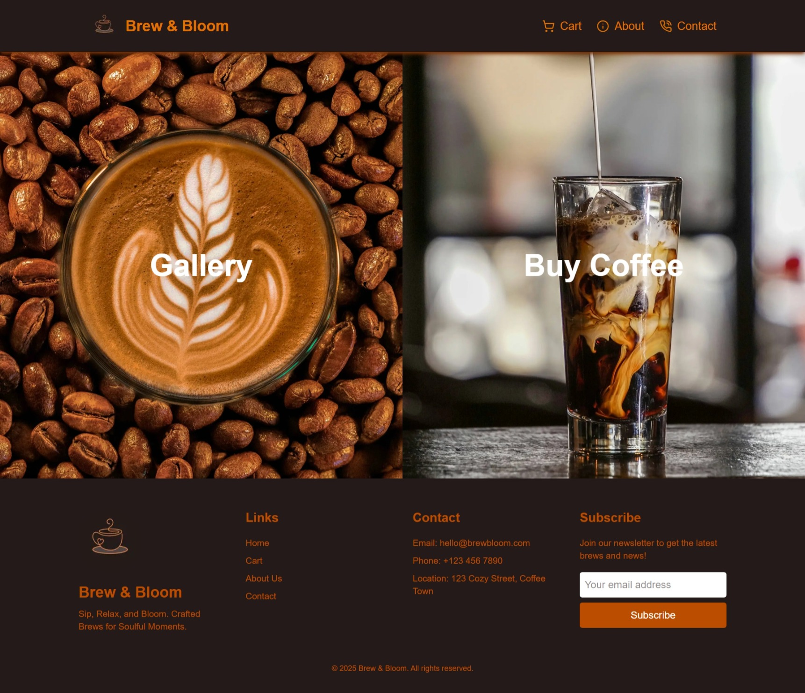

<h1 align="center">☕🌸 Bloom & Brew – Coffee that Inspires</h1>

<p align="center">
  A cozy café experience brewed into a web app.<br/>
  Sip, shop, explore — all from your screen.
</p>

<p align="center">
  <a href="https://coffee-cafe-app.vercel.app/landing">
    
  </a>
</p>

---

## 📸 Preview



---

## ✨ Features

* 🖼️ **Animated Landing Page** – Two-panel gallery/shop split with smooth transitions.
* ☕ **Buy Coffee Section** – Scrollable menu of delicious blends.
* 🖼️ **Gallery Page** – Responsive grid from custom API (`/api/gallery`), opens full-screen lightbox.
* 📬 **Contact Page** – Styled form with toast notifications via `react-hot-toast`.
* 🧠 **About Page** – Brewing philosophies and coffee-making techniques.
* ✅ **Success Page** – Order confirmation with sweet messaging.
* 📱 **Responsive Design** – Tailwind CSS goodness on every screen.
* 🧼 **Linted & Pretty** – ESLint + Prettier = happy codebase.

---

## 🛠️ Tech Stack

* **React** + **TypeScript**
* **Next.js App Router**
* **Tailwind CSS**
* **Custom API Routes**
* **react-hot-toast**
* **ESLint + Prettier**

---

## 📦 Getting Started

1. **Clone this repo**

```bash
git clone https://github.com/your-username/bloom-and-brew.git
cd bloom-and-brew


2. **Install dependencies**

```bash
npm install
# or
yarn
```

3. **Run development server**

```bash
npm run dev
```

4. **Open in browser**
   Go to: [http://localhost:3000/landing](http://localhost:3000/landing)

---

## 🧹 NPM Scripts

```json
"scripts": {
  "dev": "next dev",
  "build": "next build",
  "start": "next start",
  "lint": "next lint",
  "format": "prettier --write ."
}
```

---

## ✍️ Author

Built with ❤️ and caffeine by [@sanakhuram](https://skhuram.netlify.app)

---

## ☕ License

Open-source and free to sip, stir, or remix.


